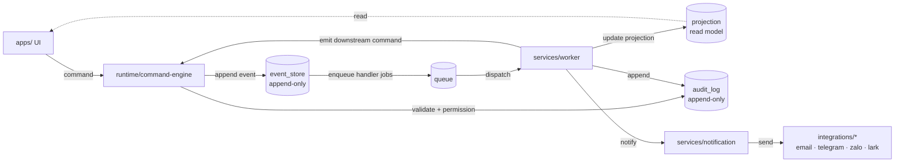

# 40 — Event-driven Runtime

## Status
Draft Canonical

## Purpose

Mô tả cách Core Runtime của LAOCONG_VOS vận hành theo mô hình **event-driven**:

- Mọi mutation đi qua **command**.
- Mỗi command thành công sinh **event** ghi vào append-only event store.
- Event được xử lý bởi 1..N **handler** (idempotent, replayable).
- Mọi bước đều có **audit** với `traceId` + `correlationId`.

Tài liệu này định nghĩa contract của command, event, queue, handler, audit.

---

## Core Principles

```txt
1. Append-only event store.
2. Append-only audit log.
3. Idempotent handler (event id làm dedup key).
4. Command-driven mutation (không có "shortcut" sửa state).
5. Every command emits ≥ 1 event (kể cả command bị reject).
6. Replayable event stream — cho phép rebuild projection.
7. Eventual consistency — UI không giả định "ghi xong là thấy ngay".
8. Trace end-to-end qua traceId + correlationId.
```

---

## Canonical event flow (Mermaid)



> Diagram minh hoạ luồng chuẩn 1 chiều. Diagram chi tiết hơn (state machine,
> compensation, replay) sẽ thêm ở Turn 4 trong `canonical/diagrams/`.

---

## Command contract

```txt
Command {
  id            : uuid                # idempotency key
  type          : string              # vd. TASK_ASSIGN, INVOICE_APPROVE
  version       : int                 # schema version
  tenant_id     : uuid
  actor_id      : uuid                # who issued
  occurred_at   : timestamptz
  trace_id      : uuid                # truyền end-to-end
  correlation_id: uuid                # gắn nhóm command/event liên quan
  payload       : jsonb               # validated by schema/<type>.<version>
  source        : enum(UI, INTEGRATION, WORKER, SCHEDULER, CLI)
}
```

Quy tắc command:

```txt
- KHÔNG trùng id (idempotent on dispatch).
- PHẢI có schema validation trước khi vào event store.
- PHẢI qua permission-engine trước khi dispatch.
- KHÔNG được sửa command đã dispatch — phát command "đối ứng" nếu cần.
```

---

## Event contract

```txt
Event {
  id            : uuid                # primary dedup key
  type          : string              # vd. TASK_ASSIGNED, INVOICE_REJECTED
  version       : int                 # schema version
  tenant_id     : uuid
  occurred_by   : uuid                # actor / system
  occurred_at   : timestamptz
  trace_id      : uuid
  correlation_id: uuid
  source_command_id: uuid             # command sinh ra event này
  payload       : jsonb
  checksum      : text                # hash của payload (audit-friendly)
}
```

Quy tắc event:

```txt
- Append-only. KHÔNG update / delete.
- Mỗi command thành công sinh ≥ 1 event.
- Command bị reject cũng emit *_REJECTED event (audit lý do).
- Event có version. Migration không phá schema cũ.
- Event nhạy cảm (PII / financial) PHẢI có policy access riêng.
```

---

## Queue & handler

| Item | Chuẩn |
|---|---|
| Queue impl giai đoạn 1 | Postgres `LISTEN/NOTIFY` hoặc bảng `task_queue` poll-based |
| Queue abstraction | `packages/event-bus` (thay được Redis/NATS sau khi cần scale) |
| Handler registration | declare ở `runtime/event-engine` qua subscriber map |
| Dedup key | `event.id` |
| Retry policy | exponential backoff, max N attempt (cấu hình per handler type) |
| Failure | sau max attempt → DLQ (dead-letter queue) — KHÔNG drop silent |
| Replay | thủ công, audit nặng, KHÔNG tự động trên prod |

Quy tắc handler:

```txt
- PHẢI idempotent (xử lý event 2 lần ≠ ghi sai state).
- PHẢI commit projection update + audit trong cùng transaction (nếu cùng DB).
- PHẢI emit downstream command qua command-engine (KHÔNG ghi state thẳng).
- PHẢI có timeout + cancellation token.
- PHẢI có structured log (traceId + correlationId).
```

---

## Audit & observability

Bắt buộc trên mọi command/event/handler:

```txt
- traceId            : truy nguyên end-to-end qua nhiều service
- correlationId      : gom nhóm các command/event cùng "câu chuyện nghiệp vụ"
- append-only        : audit_log + event_store không update/delete
- event log          : event_store append-only
- status history     : projection lưu transition (NEW → ACK → ...)
- audit trail        : audit_log ghi who/when/what/why
- runtime report     : engine xuất report định kỳ
- health check       : /health endpoint mỗi service
- self-test          : Test Console mỗi engine chạy được offline
```

---

## State machine (mẫu — TASK lifecycle)

```txt
NEW
 ├─ ACK            (worker accept)
 │   ├─ IN_PROGRESS
 │   │   ├─ WAITING (chờ input external)
 │   │   ├─ REVIEW
 │   │   │   ├─ DONE
 │   │   │   │   └─ CLOSED
 │   │   │   └─ REJECTED  (compensation event)
 │   │   └─ CANCELLED     (override)
 │   └─ TIMED_OUT
 └─ REJECTED               (validation/permission fail)
```

State PHẢI:

```txt
- rõ (mỗi state có doc string).
- audit được (mỗi transition tạo event).
- transition-safe (chỉ chuyển qua các transition hợp lệ).
- policy-safe (kiểm permission trước khi transition).
```

---

## Reject & compensation

Command bị reject:

```txt
1. command-engine emit *_REJECTED event với reason.
2. permission-engine có thể emit *_FORBIDDEN event riêng (audit role attempt).
3. UI hiển thị reject + cho phép user retry với input đã sửa.
4. KHÔNG xoá command đã dispatch — chỉ phát event đối ứng.
```

Compensation (rollback nghiệp vụ):

```txt
1. KHÔNG xoá event/audit cũ.
2. Phát event compensating mới (vd. TASK_REASSIGNED_BY_OVERRIDE).
3. Projection update ngược lại từ event mới.
4. Audit trail giữ cả 2 chiều (forward + compensation).
```

---

## Guardrails

```txt
G-1  Event store là APPEND-ONLY tuyệt đối.
G-2  Mỗi event PHẢI có id, type, version, occurred_at, occurred_by, tenant_id, traceId, correlationId, payload, checksum.
G-3  Mỗi handler PHẢI idempotent.
G-4  Mỗi command PHẢI sinh ≥ 1 event (kể cả reject).
G-5  KHÔNG cho UI / service ghi thẳng projection (trừ projection rebuilder do runtime gọi).
G-6  KHÔNG cho integration emit business event.
G-7  Projection có thể bị rebuild — KHÔNG là source of truth.
G-8  Schema event PHẢI có versioning.
G-9  Replay là thao tác thủ công, audit nặng, KHÔNG tự động trên prod.
G-10 Event nhạy cảm PHẢI mã hoá at rest + policy access riêng.
```

---

## Non-goals

```txt
- Không "fire-and-forget" event không có handler.
- Không event KHÔNG version.
- Không handler chạy thẳng SQL "side-channel".
- Không synchronous chain command quá sâu (>3) — phải break thành event chain.
- Không "real-time" stricter hơn business yêu cầu (eventual consistency là mặc định).
```

---

## TODO (sẽ làm ở Turn 4 + phase tương lai)

```txt
[ ] Vẽ Mermaid diagram event-flow phiên bản đầy đủ (gồm reject + compensation + replay) → canonical/diagrams/event-flow.mmd
[ ] Vẽ task-state-machine.mmd → canonical/diagrams/task-state-machine.mmd
[ ] Vẽ layered-architecture.mmd → canonical/diagrams/layered-architecture.mmd
[ ] Định nghĩa schema migration policy cho event versioning ở phase database bootstrap.
[ ] Định nghĩa DLQ inspection runbook ở 00_SYSTEM_BRAIN/runbooks/.
```

---

## References

- Source: [`../source-notes/SOURCE_NOTE_20260510_00-prompt-philosophy.md`](../source-notes/SOURCE_NOTE_20260510_00-prompt-philosophy.md) (sec VIII — Command architecture; sec IX — Event flow; sec X — State machine; sec XI — Audit & observability)
- ADR-0004 — Event-driven Operational Runtime.
- ADR-0003 — Runtime-first architecture.
- Runtime detail: [`./10_RUNTIME_FIRST_ARCHITECTURE.md`](./10_RUNTIME_FIRST_ARCHITECTURE.md)
- Override detail: [`./50_HUMAN_OVERRIDE_POLICY.md`](./50_HUMAN_OVERRIDE_POLICY.md)
- Layer README: [`../../../runtime/README.md`](../../../runtime/README.md)
- DB layer: [`../../../database/README.md`](../../../database/README.md)
- Packages: [`../../../packages/README.md`](../../../packages/README.md) (event-bus, core-contracts)
- Diagram (event happy / reject / compensation / dead-letter / replay): [`./diagrams/event-flow.mmd`](./diagrams/event-flow.mmd)
- Diagrams folder README: [`./diagrams/README.md`](./diagrams/README.md)

---

## Last reviewed

```txt
2026-05-10  — Phase 002 Turn 3 — Initial canonical version.
```
